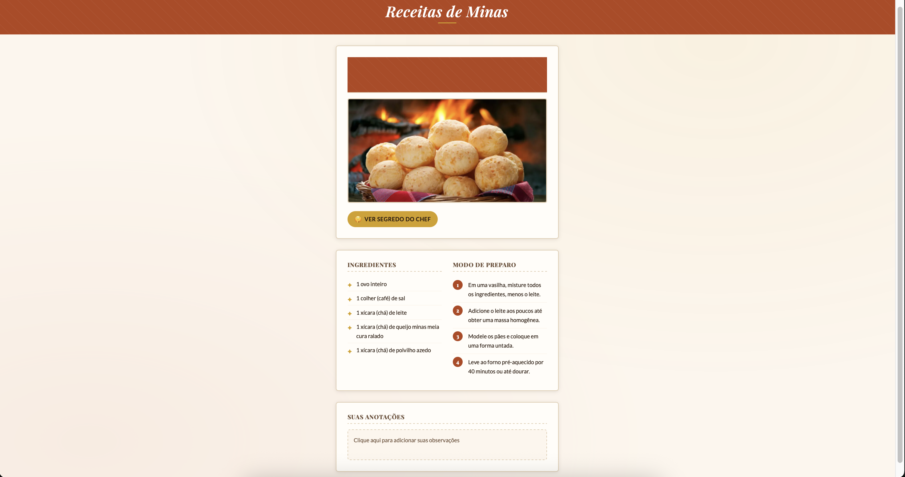

# Receitas de Minas

Um projeto web para a PUC Minas, inspirado na rica culinária mineira, desenvolvido com foco em boas práticas de front-end e construção de interfaces modernas.

---

## Preview



---

## Acesse o projeto

👉 https://theogoulart333.github.io/receitas-de-minas/

---

## Repositório

👉 https://github.com/TheoGoulart333/receitas-de-minas

---

## Tecnologias utilizadas

- HTML5 (estrutura semântica)
- CSS3 (variáveis, responsividade e layout moderno)

---

## Objetivo

Este projeto foi desenvolvido com o objetivo de:

- Praticar estruturação semântica com HTML
- Melhorar habilidades em CSS moderno
- Criar um layout organizado e visualmente agradável
- Simular uma aplicação real de receitas

---

## Funcionalidades

- Visualização de receita completa  
- Segredo do chef com interação (popover)  
- Área de anotações editável  
- Layout responsivo para diferentes telas  

---

## Aprendizados

Durante o desenvolvimento, trabalhei com:

- Organização de código front-end
- Uso de variáveis CSS (design tokens)
- Criação de layouts com grid
- Responsividade para mobile
- Melhoria na experiência do usuário (UX)

---

## Como executar o projeto

```bash
# Clone o repositório
git clone https://github.com/TheoGoulart333/receitas-de-minas.git

# Acesse a pasta
cd receitas-de-minas

# Abra o arquivo no navegador
index.html
